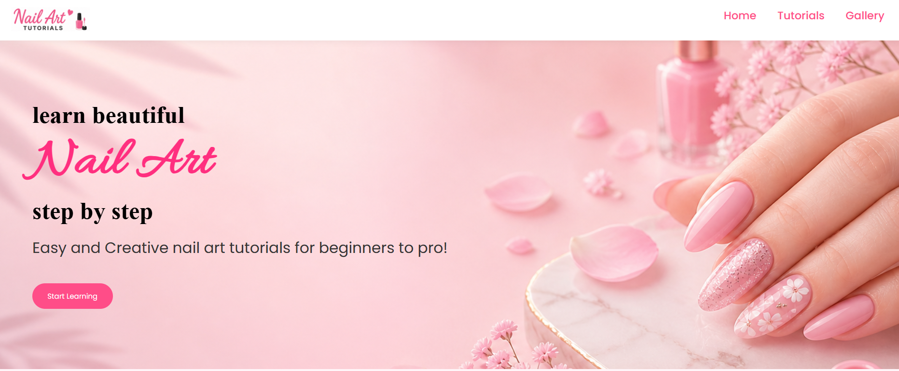
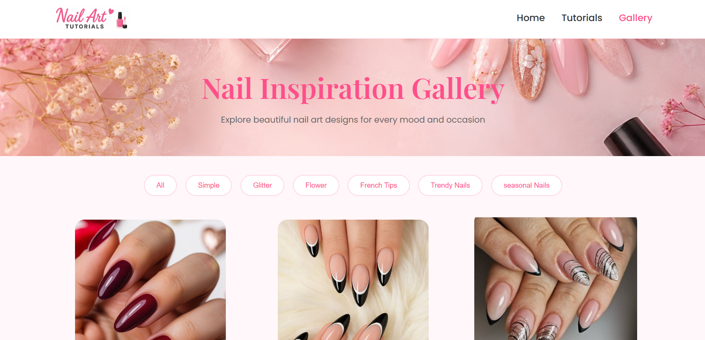
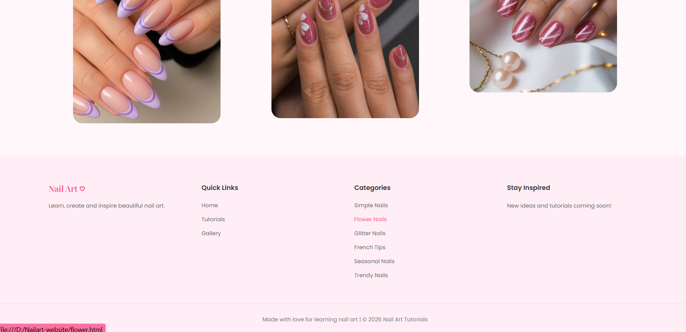
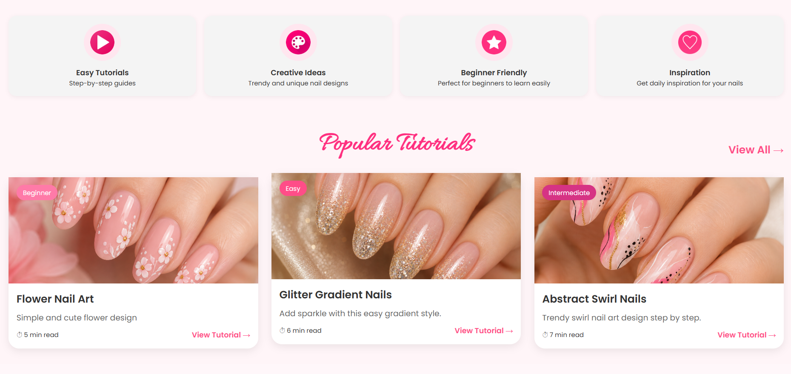
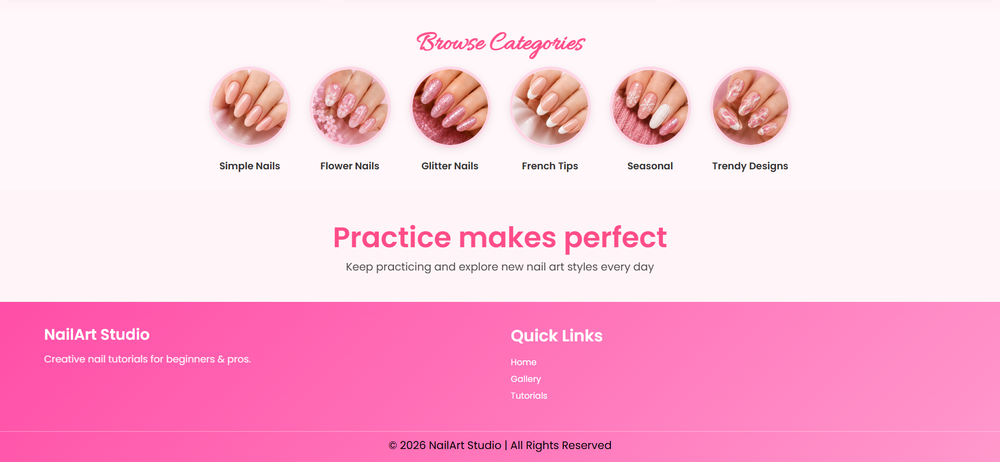

# Nail Art Tutorial Website

A stylish and beginner-friendly nail art tutorial website created using HTML and CSS. This project showcases beautiful nail art designs, step-by-step tutorials, and a clean responsive layout.

# Features

* Responsive homepage design
* Beautiful nail art gallery
* Step-by-step tutorial pages
* Interactive navigation bar
* Hover effects and smooth styling
* Beginner-friendly project structure

# Built With

* HTML5
* CSS3

# Project Structure

Nailart-website/
│
├── index.html
├── gallery.html
├── flower.html
├── frenchtip.html
├── glitter.html
├── seasonal.html
├── simple.html
├── trendynail.html
│
├── tutorial1.html
├── tutorial1.css
├── tutorial2.html
├── tutorial2.css
├── tutorial3.html
├── tutorial3.css
│
├── home.css
├── gallery.css
│
├── images/
├── gallery-img/
├── icons/
│
└── README.md

# Website Preview

# Homepage

---
# Gallery Image 1

# Gallery Image 2

---
# Tutorials

---
# Categories

# preview

This website includes:

* Nail art inspiration gallery
* Stylish homepage
* Tutorial sections with images
* Modern navigation effects

# Purpose of the Project

This project was created to practice:

* Website design
* HTML structure
* CSS styling
* Responsive layouts
* Navigation bar effects

# Author

Created by Trivedi Jiya.

# Support

If you like this project, consider giving it a star on GitHub!
